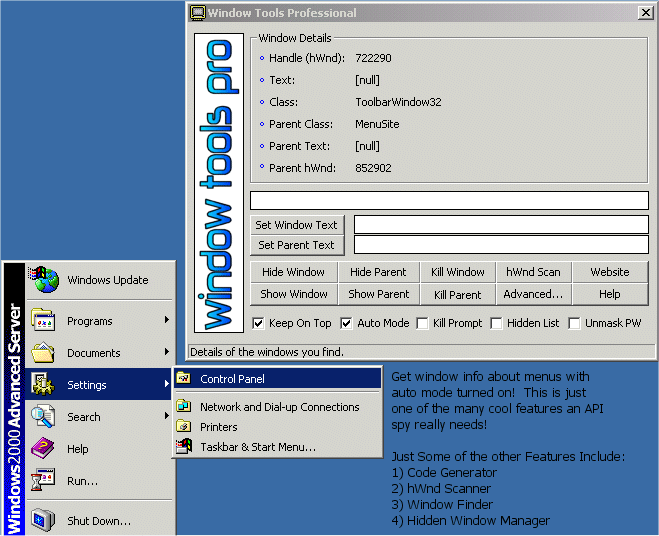



## A\.P\.I\. Tool \- Window Tools Professional \(Ultra\-API spy\)

### Description

This is an Ultra API Spy (lots o' features). Some of the features include hWnd Scanner, Code Generator, Window Finder, and Hidden Window Manager - allows you to hide multiple windows [and get them back!] There is a Help.doc included to help you use it (if you need help). I'm sure you'll find this useful for your own VB (and even some C++!) programming (especially you AOL programmers). Please make sure to VOTE if you like it!
 
### More Info
 

             |
---                |---
**Submitted On**   |2001-12-09 17:46:56
**By**             |[kirse](https://github.com/Planet-Source-Code/PSCIndex/blob/master/ByAuthor/kirse.md)
**Level**          |Advanced
**User Rating**    |4.9 (260 globes from 53 users)
**Compatibility**  |VB 3\.0, VB 4\.0 \(16\-bit\), VB 4\.0 \(32\-bit\), VB 5\.0, VB 6\.0, VB Script, ASP \(Active Server Pages\) , VBA MS Access, VBA MS Excel
**Category**       |[Complete Applications](https://github.com/Planet-Source-Code/PSCIndex/blob/master/ByCategory/complete-applications__1-27.md)
**World**          |[Visual Basic](https://github.com/Planet-Source-Code/PSCIndex/blob/master/ByWorld/visual-basic.md)
**Archive File**   |[A\_P\_I\_\_Too406631292001\.zip](https://github.com/Planet-Source-Code/kirse-a-p-i-tool-window-tools-professional-ultra-api-spy__1-29566/archive/master.zip)

